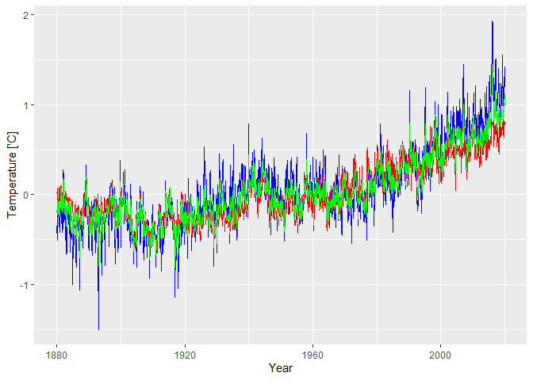

GISS Surface Temperature Analysis (GISTEMP v4)

https://data.giss.nasa.gov/gistemp/

The GISS Surface Temperature Analysis (GISTEMP v4) is an estimate of global surface temperature change. 

GISTEMP Team, 2020: GISS Surface Temperature Analysis (GISTEMP), version 4. NASA Goddard Institute for Space Studies. Dataset accessed 20YY-MM-DD at https://data.giss.nasa.gov/gistemp/.

Lenssen, N., G. Schmidt, J. Hansen, M. Menne, A. Persin, R. Ruedy, and D. Zyss, 2019: Improvements in the GISTEMP uncertainty model. J. Geophys. Res. Atmos., 124, no. 12, 6307-6326, doi:10.1029/2018JD029522.


```r
require("ggplot2")
```

```
## Loading required package: ggplot2
```

```
## Warning: package 'ggplot2' was built under R version 3.5.3
```

```r
require("extrafont")
```

```
## Loading required package: extrafont
```

```
## Warning: package 'extrafont' was built under R version 3.5.2
```

```
## Registering fonts with R
```

## Load and Convert Monthly Global Temperature Data 


```r
tempGlobal <- read.csv("https://data.giss.nasa.gov/gistemp/tabledata_v4/GLB.Ts+dSST.csv", sep=",", na = "NA", skip = 1)

tempNorth <- read.csv("https://data.giss.nasa.gov/gistemp/tabledata_v4/NH.Ts+dSST.csv", sep=",", na = "NA", skip = 1)

tempSouth <- read.csv("https://data.giss.nasa.gov/gistemp/tabledata_v4/SH.Ts+dSST.csv", sep=",", na = "NA", skip = 1)

tempZones <- read.csv("https://data.giss.nasa.gov/gistemp/tabledata_v4/ZonAnn.Ts+dSST.csv", sep=",", na = "NA", skip = 1)

currMonth <- 1
tG <- tempGlobal[,c('Year', 'Jan')]
names(tG)[names(tG) == "Jan"] <- "global"
tG$month = currMonth

tN <- tempNorth[,c('Year', 'Jan')]
names(tN)[names(tN) == "Jan"] <- "north"
tN$month = currMonth

tS <- tempSouth[,c('Year', 'Jan')]
names(tS)[names(tS) == "Jan"] <- "south"
tS$month = currMonth


for (month in c("Feb","Mar","Apr","May","Jun","Jul","Aug","Sep","Oct","Nov","Dec")) {
  currMonth <- currMonth+1
  tempG <- tempGlobal[,c('Year', month)]
  names(tempG)[names(tempG) == month] <- "global"
  tempG$month = currMonth
  tG <- rbind(tG, tempG)

  tempN <- tempNorth[,c('Year', month)]
  names(tempN)[names(tempN) == month] <- "north"
  tempN$month = currMonth
  tN <- rbind(tN, tempN)
  
  tempS <- tempSouth[,c('Year', month)]
  names(tempS)[names(tempS) == month] <- "south"
  tempS$month = currMonth
  tS <- rbind(tS, tempS)  
}

tG <- merge(tG,tN, by=c("Year","month"))
tG <- merge(tG,tS, by=c("Year","month"))
names(tG)[names(tG) == 'Year'] <- 'year'
tG$ts <- signif(tG$year + (tG$month-0.5)/12, digits=6)
tG$time <- paste(tG$year,tG$month, '15 00:00:00', sep='-')
tG <- tG[order(tG$ts),]

write.table(tG, file = "csv/monthly_temperature_global.csv", append = FALSE, quote = TRUE, sep = ",",
            eol = "\n", na = "NA", dec = ".", row.names = FALSE,
            col.names = TRUE, qmethod = "escape", fileEncoding = "UTF-8")
```


## Plot Temperature


```r
require("ggplot2")
temp <- read.csv("./csv/monthly_temperature_global.csv", sep=",")
mp <- ggplot() +
      geom_line(aes(y=temp$global, x=temp$ts), color="green") +
      geom_line(aes(y=temp$north, x=temp$ts), color="blue") +
      geom_line(aes(y=temp$south, x=temp$ts), color="red") +
      xlab("Year") + ylab("Temperature ['C]")
mp
```

<!-- -->
